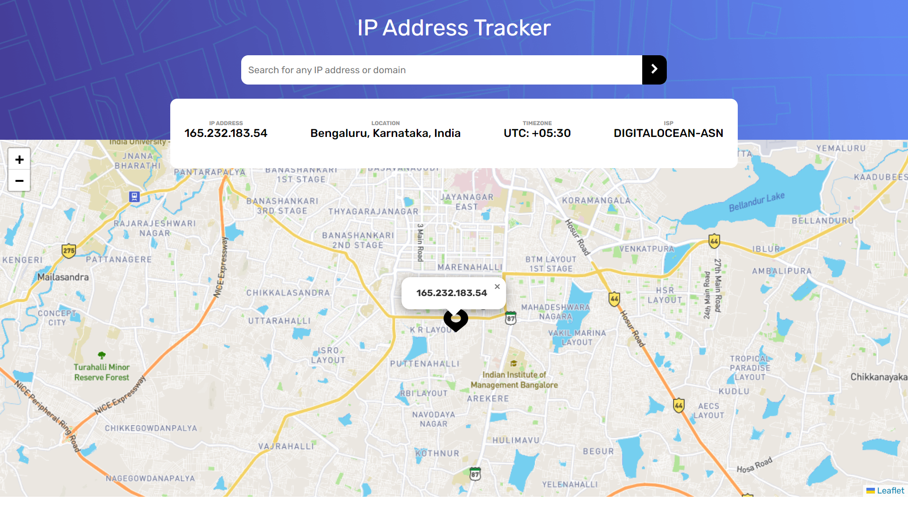

# Frontend Mentor - IP address tracker solution

This is a solution to the [IP address tracker challenge on Frontend Mentor](https://www.frontendmentor.io/challenges/ip-address-tracker-I8-0yYAH0). Frontend Mentor challenges help you improve your coding skills by building realistic projects. 

## Table of contents

- [Overview](#overview)
  - [The challenge](#the-challenge)
  - [Screenshot](#screenshot)
  - [Links](#links)
- [My process](#my-process)
  - [Built with](#built-with)
  - [What I learned](#what-i-learned)
- [Author](#author)

**Note: Delete this note and update the table of contents based on what sections you keep.**

## Overview

### The challenge

Users should be able to:

- View the optimal layout for each page depending on their device's screen size
- See hover states for all interactive elements on the page
- See their own IP address on the map on the initial page load
- Search for any IP addresses or domains and see the key information and location

### Screenshot



### Links

- [Solution URL](https://www.frontendmentor.io/solutions/ip-address-tracker-using-vanilla-js-Yt3gCTWThI)
-  [Live URL](https://ip-address-tracker-nine-chi.vercel.app/)

## My process

### Built with

- Semantic HTML5 markup
- CSS custom properties
- Flexbox
- Mobile-first workflow


### What I learned
This challenge really helped me get a solid grasp on using APIs.
Some code I'm proud of:
```js
fetch("https://ipapi.co/json/")
  .then((res) => res.json())
  .then((data) => renderresult(data))
  .catch((error) => displayError(error));

function renderresult(data) {
  if (data.error) {
    throw `${data.reason}`;
  }
  const ipadd = document.getElementById("ipadd");
  const location = document.getElementById("location");
  const timezone = document.getElementById("timezone");
  const isprovider = document.getElementById("isprovider");
  ipadd.innerHTML = data.ip;
  isprovider.innerHTML = data.org;
  location.innerHTML = `${data.city}, ${data.region}, ${data.country_name}`;
  if (data.utc_offset !== null) {
    timezone.innerHTML =
      "UTC: " + data.utc_offset.slice(0, 3) + ":" + data.utc_offset.slice(3);
  } else {
    timezone.innerHTML = data.timezone;
  }
  map.setView([data.latitude, data.longitude], 13);
  marker.setLatLng([data.latitude, data.longitude]);
  marker.bindPopup(`<b>${data.ip}</b>`).openPopup();
}
```

## Author
- Website - [Jitesh117](https://my-project-green-zeta.vercel.app/)
- Frontend Mentor - [@Jitesh117](https://www.frontendmentor.io/profile/yourusername)
- Twitter - [@Jitesh_117](https://www.twitter.com/yourusername)
